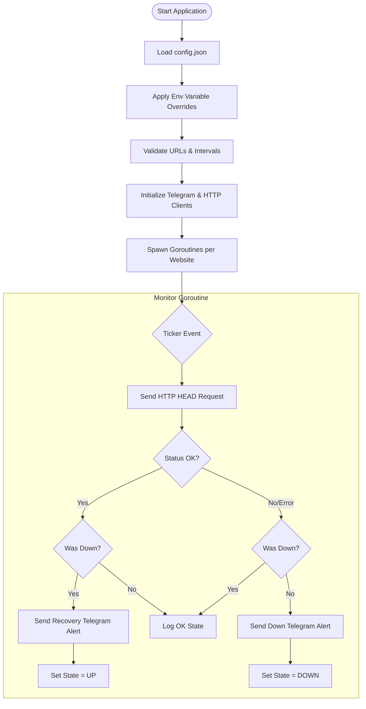

# 🌐 go-ws-reachability

[](https://golang.org)
[](LICENSE)
[](https://github.com/sknr/go-ws-reachability)

A lightweight, reliable, and containerized website uptime monitor written in Go. It performs scheduled HTTP `HEAD` requests to verify website reachability and sends instant Telegram alerts on status changes.

---

## ✨ Features

- **⚡ Lightweight & Fast:** Written in Go with minimal dependencies.
- **🛡️ Connection Leak Free:** Explicitly handles HTTP connection cleanups.
- **🔄 Smart Uptime Transitions:** Alerting happens **only** when a website goes down (`UP` ➔ `DOWN`) or recovers (`DOWN` ➔ `UP`) to prevent Telegram message spam.
- **🐳 Docker Ready:** Multi-stage `Dockerfile` creating minimal, containerized runtime environments.
- **🔌 Environment Variable Support:** Easily inject credentials (`TELEGRAM_BOT_TOKEN`, `TELEGRAM_USER_ID`) via environments for Kubernetes, Docker Compose, or Cloud environments.
- **🛑 Graceful Shutdown:** Automatically catches termination signals (`SIGINT`, `SIGTERM`), cancels in-flight HTTP requests, and shuts down cleanly.

---

## 📐 How it Works



---

## 🚀 Quick Start

### 1. Configure the Application
Copy the example config to the actual config location:
```bash
cp docker/data/config.json data/config.json
```

Modify `data/config.json` with your parameters:
```json
{
  "TelegramBotToken": "YOUR_TELEGRAM_BOT_TOKEN",
  "TelegramUserID": "YOUR_TELEGRAM_USER_ID",
  "ClientRequestTimeout": "5s",
  "Websites": [
    {
      "Name": "Google",
      "URL": "https://google.com",
      "Interval": "5m"
    },
    {
      "Name": "Portfolio",
      "URL": "https://example.com",
      "Interval": "15m"
    }
  ]
}
```

### 2. Run Locally
```bash
go run main.go
```

---

## 🐳 Docker Deployment

### With Docker Compose
Run the app in the background using Docker Compose:
```bash
docker compose up -d --build
```
> **Note:** Modern compose parses the Dockerfile, builds the Go binary inside a multi-stage builder container, and spins it up inside a minimal alpine container automatically.

### Manual Run (Without Compose)
1. **Build the image**:
   ```bash
   make build
   ```
2. **Run the container**:
   ```bash
   make run
   ```

---

## ⚙️ Configuration Properties

| Property | Description | Env Override Option | Default |
| :--- | :--- | :--- | :--- |
| `TelegramBotToken` | Your Telegram Bot API token. | `TELEGRAM_BOT_TOKEN` | *Required* |
| `TelegramUserID` | Your Telegram chat/user ID to receive alerts. | `TELEGRAM_USER_ID` | *Required* |
| `ClientRequestTimeout` | The HTTP request timeout duration (e.g. `5s`, `1m`). | - | `15s` |
| `Websites` | List of website configuration objects. | - | `[]` |
| `Websites.Name` | Name identifier for the website in notifications. | - | *Required* |
| `Websites.URL` | Absolute URL to check (e.g. `https://google.com`). | - | *Required* |
| `Websites.Interval` | Monitoring poll interval duration (e.g., `1m`, `1h`). | - | *Required* |

---

## 🛠️ Development

We use `make` targets to maintain project quality. Ensure your changes compile, pass tests, and satisfy linting rules:

- **Run all checks (format, test, lint, vulnerabilities)**:
  ```bash
  make verify
  ```
- **Run Unit Tests**:
  ```bash
  make test
  ```
- **Run Linter**:
  ```bash
  make lint
  ```
- **Check for vulnerabilities**:
  ```bash
  make vuln
  ```
